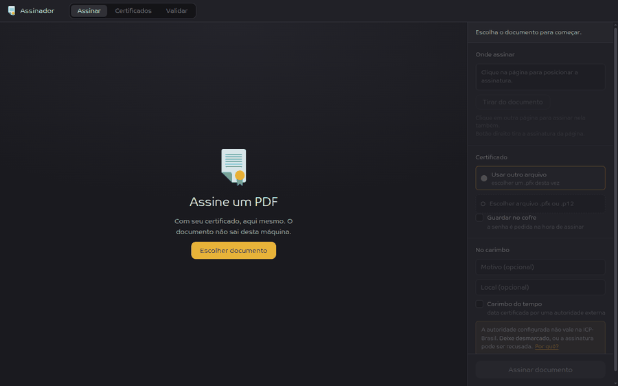
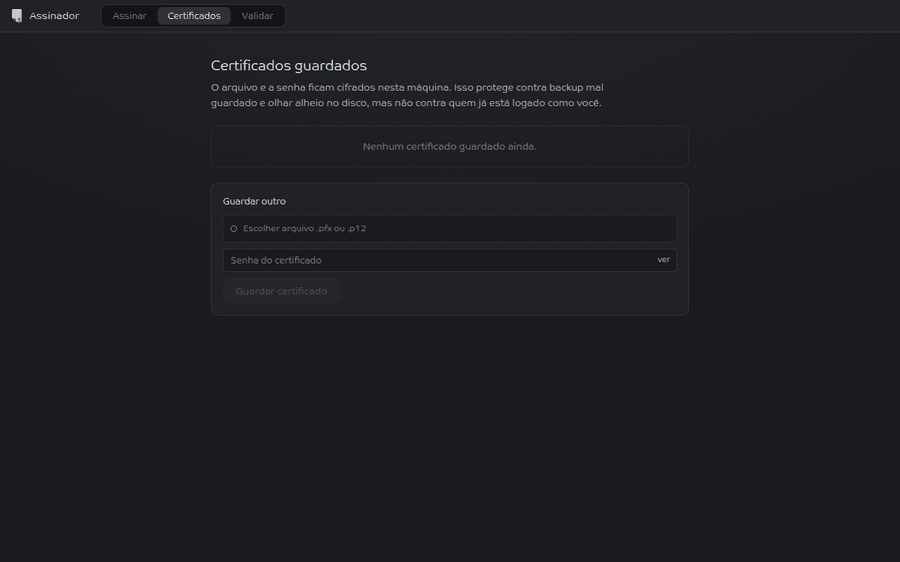
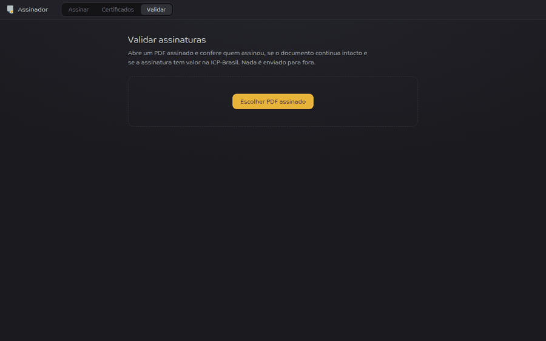

# Assinador digital

App **local** para assinar PDF com certificado digital ICP-Brasil A1
(`.pfx`/`.p12`), conferir assinaturas e guardar certificados. Roda na sua
máquina, em `127.0.0.1`, numa janela própria.

O documento, o certificado e a senha **não saem daqui**. Nada é gravado em
disco fora do que você pediu, não há telemetria, e as únicas conexões de rede
acontecem quando *você* liga o carimbo do tempo.

## Assinar

Abra o PDF, clique onde a assinatura entra, escolha o certificado. A marca
mostra a prévia do carimbo antes de assinar, e clicar em outra página assina
nela também.



## Guardar certificados

O `.pfx` e a senha podem ficar guardados, cifrados nesta máquina, para não
reescolher arquivo e redigitar senha a cada documento. A lista mostra só o
primeiro nome, três dígitos do CPF e a validade.



## Validar

Abre um PDF assinado e diz quem assinou, se o documento continua intacto, se a
cadeia fecha numa AC da ICP-Brasil e o que cada assinatura cobre. Roda offline.



## Instalação

Requisitos: Ubuntu e Python 3.11 ou mais novo.

```bash
git clone https://github.com/danielbbarcelos/assinador-digital.git
cd assinador-digital
./run.sh
```

O `run.sh` cria o ambiente virtual na primeira execução (com `uv` se estiver
instalado, senão `venv`), instala as dependências e abre o app.

### Instalar no menu de aplicativos

```bash
./install.sh
```

Coloca o ícone, cria o lançador no menu e o comando `assinador` no terminal.
Não usa `sudo` e não copia nada para fora do repositório: o lançador aponta
para o `run.sh` daqui, então `git pull` já atualiza o app instalado.

### Janela nativa

A interface abre numa janela própria (pywebview + WebKit). Na maioria dos
Ubuntu Desktop isso funciona sem instalar nada. O app escolhe sozinho, nesta
ordem:

1. **GTK/WebKit** do sistema, se o binding for 4.1 ou mais novo;
2. **Qt**, se estiver instalado (`pip install pywebview[qt] qtpy PyQt6-WebEngine`),
   que vem inteiro pelo pip, sem `sudo`, mas ocupa cerca de 500 MB;
3. **navegador padrão**, que sempre funciona.

Só cai para o passo 3 quem não tiver nenhum dos dois. O caso típico é máquina
que veio de upgrade do 22.04 e ficou com o WebKit2 4.0, de 2022. A correção é
um pacote:

```bash
sudo apt install gir1.2-webkit2-4.1
```

## Cadeia da ICP-Brasil

Para validar cadeia, o app precisa conhecer as ACs da ICP-Brasil. Baixe para
`certs/`:

```bash
cd certs
curl -O http://acraiz.icpbrasil.gov.br/credenciadas/CertificadosAC-ICP-Brasil/ACcompactado.zip
unzip ACcompactado.zip && rm ACcompactado.zip
```

O repositório oficial é o do
[ITI](https://www.gov.br/iti/pt-br/assuntos/repositorio/repositorio-ac-raiz).
Certificado autoassinado colocado ali é tratado como âncora de confiança, que é
o formato das raízes da ICP-Brasil. As âncoras do sistema também são carregadas.

O diretório está no `.gitignore`: certificado de AC é público, mas ninguém
precisa do seu espelho deles versionado.

## Carimbo do tempo, e por que ele vem desligado

Na ICP-Brasil, carimbo do tempo só vale vindo de uma **ACT credenciada**. As
ACTs brasileiras são serviços pagos, com credencial, e nenhuma responde
publicamente. A TSA que vem configurada é criptograficamente impecável e não é
credenciada aqui.

O efeito no [validador do ITI](https://validar.iti.gov.br/) é pior do que
parece:

- *"Carimbo de tempo reprovado"*, porque a autoridade não é brasileira;
- *"Assinatura indeterminada"* em **todas** as assinaturas do documento,
  inclusive as de outras pessoas, que estavam válidas antes. Sem uma data
  aceita, o validador não consegue fixar o momento da assinatura.

Por isso o carimbo vem desligado e a interface avisa. Sem uma ACT contratada,
uma assinatura **sem** carimbo vale mais do que uma com.

Tendo uma ACT:

```bash
SIGN_TSA_URL=https://act.exemplo.com.br/tsa SIGN_TSA_IS_ICP=1 ./run.sh
```

`SIGN_TSA_IS_ICP=1` só desliga o aviso. Quem julga de fato é a validação, que
verifica se o certificado do carimbo encadeia numa raiz da ICP-Brasil.

## Certificado antigo (RC2/3DES/SHA-1)

`.pfx` emitido por AC antiga pode usar criptografia que o OpenSSL 3 não abre
mais. Se aparecer *"Certificado usa criptografia legada"*, reempacote você
mesmo, porque reempacotar é mexer na sua chave privada:

```bash
openssl pkcs12 -in antigo.pfx -legacy -nodes -out temp.pem
openssl pkcs12 -in temp.pem -export -out novo.pfx
rm temp.pem          # o .pem intermediário contém a chave privada SEM senha
```

## Segurança

- `uvicorn` em **`127.0.0.1`**, nunca `0.0.0.0`. Não há autenticação porque não
  há superfície remota.
- A senha do `.pfx` trafega no corpo do POST, nunca em query string, vive como
  `bytearray` e é sobrescrita com zeros no `finally`, inclusive quando dá erro.
  Não vai para log nem para mensagem de erro, e há teste para isso.
- Os bytes do PDF e do certificado só existem em memória. Não existe diretório
  de uploads para esquecer de limpar.
- O cofre de certificados é um blob cifrado com Fernet em
  `~/.config/assinador-digital`, com a chave ao lado em modo `600`. Protege
  contra backup mal guardado e olhar alheio no disco, não contra quem já está
  logado como você. Para esse nível existe o A3 em token, que é o próximo
  passo.
- A interface recebe sempre dados mascarados: nome completo, CPF inteiro,
  arquivo e senha nunca chegam ao navegador.
- Upload limitado a 50 MB para PDF e 5 MB para certificado. O PDF é validado
  por *magic bytes*, não por extensão.

## Desenvolvimento

```bash
.venv/bin/python -m pytest -m "not network"   # suíte offline
.venv/bin/python -m pytest -m network         # os que falam com a TSA
```

Os testes **geram o próprio certificado**, autoassinado, e o próprio PDF. Não
há `.pfx` real no repositório e nunca deve haver.

### Organização

```
app/
  signing.py    pyHanko puro, não importa FastAPI, dá para usar em script
  validation.py validação das assinaturas de um PDF
  vault.py      cofre cifrado de certificados
  masking.py    máscaras de nome e CPF
  errors.py     exceções tipadas, com código estável e mensagem em português
  main.py       rotas FastAPI
  desktop.py    janela pywebview + uvicorn em 127.0.0.1
  static/
    coords.js   conversão tela → pontos PDF, testada fora do browser
    app.js      interface
    vendor/     pdf.js vendorizado (build legacy)
samples/        contrato de exemplo, com dados fictícios
tools/
  validar.py    validação offline pela linha de comando
tests/
  test_coords.py      roda o pdf.js de verdade sob Node, com /Rotate
  test_signing.py     assinatura, erros de certificado, carimbo
  test_vault.py       cofre e mascaramento
  test_validation.py  relatório de validação
  test_api.py         contrato HTTP
```

**A conversão de coordenadas acontece no frontend**: o backend recebe pontos
PDF prontos, com origem no canto inferior esquerdo. É o frontend que conhece o
`scale` do pdf.js, o `devicePixelRatio` e a rotação da página.

O pdf.js é o **build legacy**. O build moderno usa `Promise.withResolvers`, que
o WebKit do Ubuntu e o Node 20 não têm.

O carimbo usa **Nimbus Sans** (pacote `fonts-urw-base35`), e a escolha não é
estética: o pyHanko escreve os avanços de glifo assumindo 1000 unidades por em,
então fonte com `unitsPerEm` 2048, que é quase toda TrueType, sai com as letras
espaçadas. Sem ela, o carimbo cai para Courier, que é base-14 e não depende de
fonte instalada.

## Próximos passos

**Token A3 (PKCS#11).** `signing.py` depende só de um `Signer` do pyHanko, então
um `load_pkcs11_signer` entra ao lado do de A1 sem mexer no resto. É por isso
que o app é uma janela e não uma aba: quem lê o token é este processo Python.

## Licença

[MIT](LICENSE).
